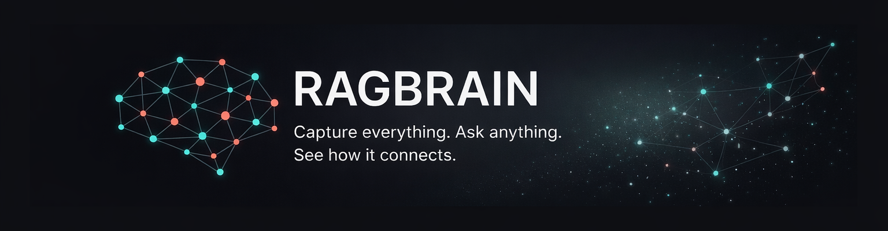
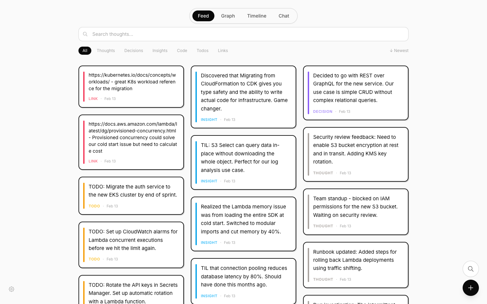
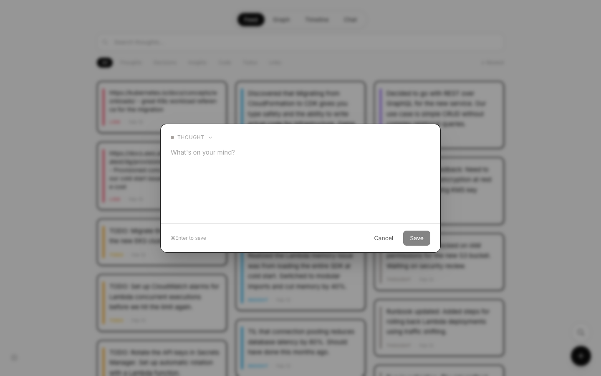
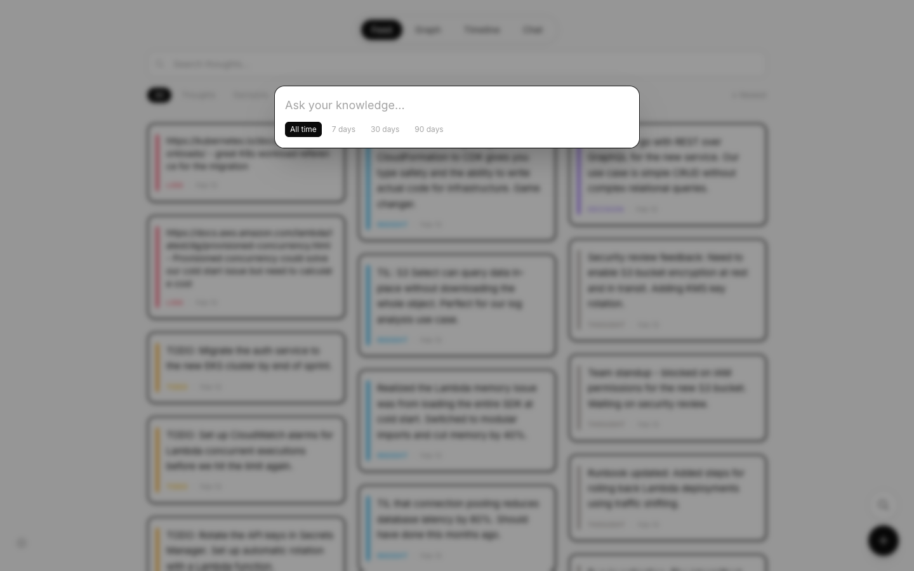
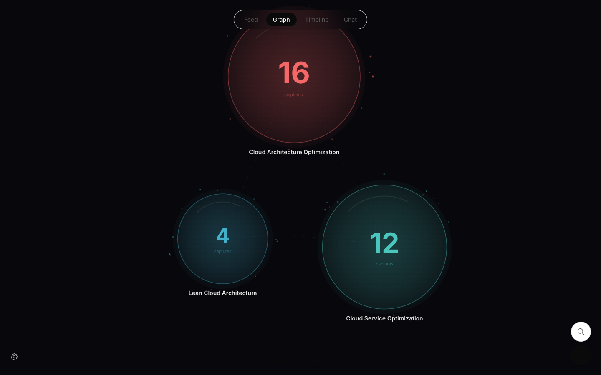
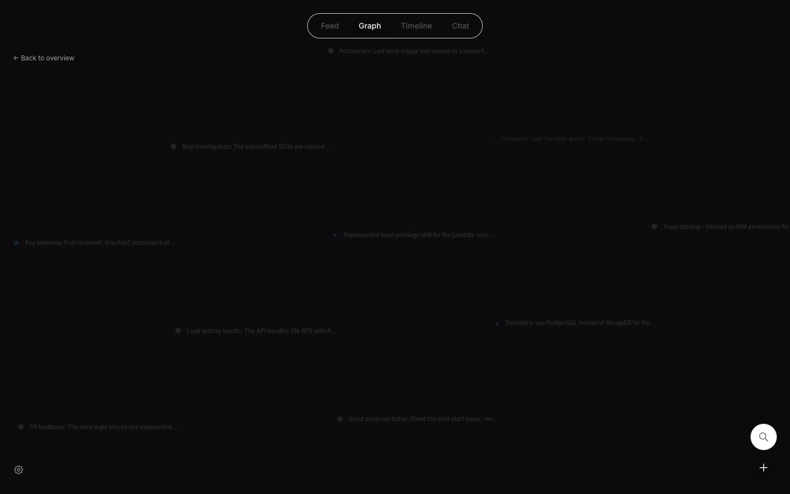
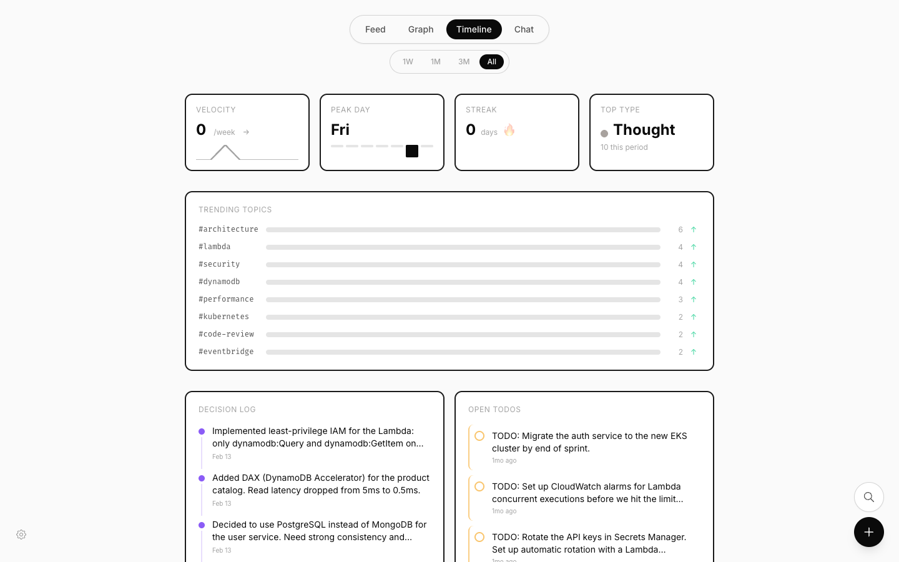
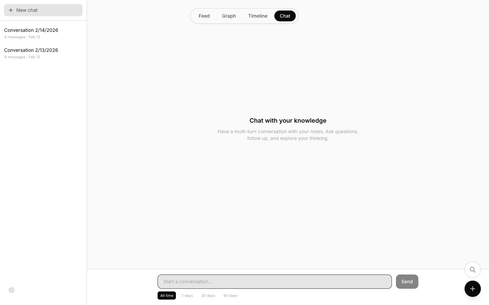
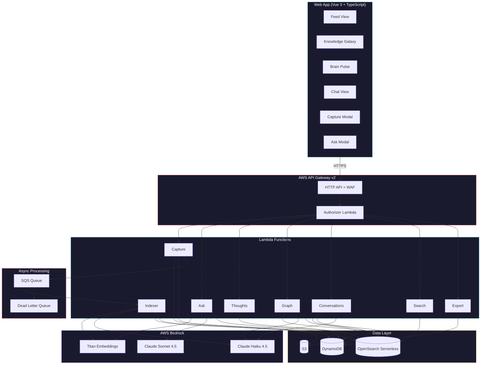
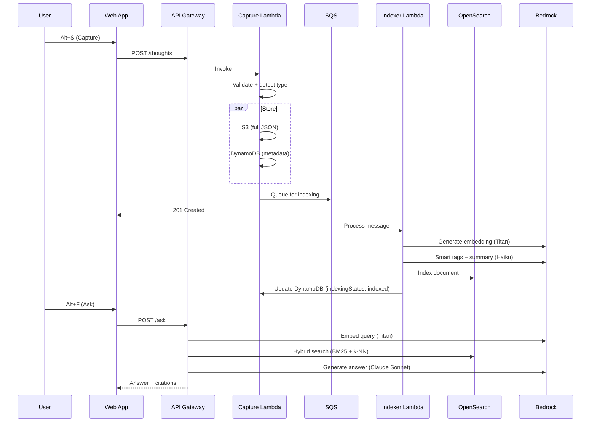

<p align="center">
  
</p>

<p align="center">
  <a href="#features">Features</a> &bull;
  <a href="#architecture">Architecture</a> &bull;
  <a href="#quick-start">Quick Start</a> &bull;
  <a href="#usage">Usage</a> &bull;
  <a href="#api-reference">API</a>
</p>

<p align="center">
  
  
  
  
  
</p>

---

Ragbrain is a personal knowledge management system that lets you capture thoughts instantly via hotkey and retrieve them with AI-powered search that cites its sources. Your knowledge is visualized as an interactive galaxy of connected ideas.

<p align="center">
  
</p>

## Features

### Instant Capture (Alt+S)

Press a hotkey, type your thought, hit save. Auto-detects whether it's a decision, insight, code snippet, todo, or link. Tags extracted automatically from hashtags. Sub-2-second end-to-end.

<p align="center">
  
</p>

### Intelligent Ask (Alt+F)

Ask questions about your captured knowledge. Hybrid search combines BM25 keyword matching with semantic vector embeddings. Every answer includes citations to the source notes with confidence scores.

<p align="center">
  
</p>

### Knowledge Galaxy

Your thoughts organized as an interactive galaxy. Theme clusters emerge automatically via K-means clustering on embeddings. LLM-generated labels describe each cluster. Drill into any cluster to explore individual thoughts and their connections.

| Galaxy Overview | Constellation Drill-In |
|:-:|:-:|
|  |  |

- **Galaxy view** -- Theme bubbles with orbiting particles, glass highlights, and flowing affinity lines
- **Constellation view** -- Thought nodes with type icons, D3 force physics, drag interaction, and breathing edges
- **ThoughtDrawer** -- Click any node to see full text, tags, and connected thoughts. Navigate node-to-node.
- **Zoom & drag** -- Scroll to zoom, drag background to pan, drag nodes to rearrange

### Brain Pulse (Timeline)

Analytics dashboard showing your capture velocity, streak, most active day, trending tags, recent decisions, and open todos.

<p align="center">
  
</p>

### Multi-Turn Chat

Have conversations with your knowledge base. Ask follow-up questions with full conversation context. Messages encrypted with KMS.

<p align="center">
  
</p>

### AI-Powered Intelligence

- **Smart Auto-Tagging** -- Claude extracts semantic tags, categories, intent, and entities
- **Related Thoughts** -- k-NN vector similarity finds connected ideas
- **Summaries** -- Automatic one-sentence summarization
- **Deterministic Clustering** -- Seeded K-means so clusters stay stable across sessions

---

## Architecture



### Data Flow



---

## Quick Start

### Prerequisites

- Node.js 20+
- AWS CLI configured with credentials
- Docker (for CDK Lambda bundling)

### 1. Clone & Install

```bash
git clone https://github.com/bobbyrathoree/ragbrain.git
cd ragbrain
npm install
```

### 2. Deploy Backend

```bash
cd packages/infra

# Bootstrap CDK (first time only)
npx cdk bootstrap aws://YOUR_ACCOUNT_ID/us-west-2

# Deploy all stacks
npx cdk deploy --all --context env=dev
```

Note the outputs:
- `ApiUrl` -- Your API Gateway endpoint
- `ApiKeySecretArn` -- Secret containing your API key

Retrieve your API key:
```bash
aws secretsmanager get-secret-value \
  --secret-id ragbrain/dev/api-key \
  --query SecretString --output text | jq -r .key
```

### 3. Configure Web App

Create `apps/web/.env.local`:
```
VITE_API_ENDPOINT=https://your-api-id.execute-api.us-west-2.amazonaws.com/dev
VITE_API_KEY=your-api-key
```

### 4. Run

```bash
cd apps/web
npm run dev
```

Open http://localhost:5173

---

## Usage

| Hotkey | Action |
|--------|--------|
| **Alt+S** | Capture a thought |
| **Alt+F** | Ask a question |
| **Cmd+K** | Command palette |

### Capture Types

| Type | Icon | Description |
|------|------|-------------|
| Thought | ● | General observations |
| Decision | ◆ | Choices with rationale |
| Insight | ★ | Realizations and learnings |
| Code | ⟨⟩ | Snippets with syntax highlighting |
| Todo | ☐ | Action items |
| Link | ↗ | URLs with context |

### Ask Examples

- "What did I decide about the database schema?"
- "Show me code snippets related to authentication"
- "What were my insights from re:Invent?"

---

## Project Structure

```
ragbrain/
├── apps/
│   └── web/                        # Vue 3 frontend
│       ├── src/
│       │   ├── api/                # API client with legacy fallback
│       │   ├── components/
│       │   │   └── views/
│       │   │       ├── graph/      # Knowledge Galaxy (Canvas 2D + D3)
│       │   │       │   ├── CanvasRenderer.ts
│       │   │       │   ├── ThoughtDrawer.vue
│       │   │       │   └── useGraphNavigation.ts
│       │   │       ├── FeedView.vue
│       │   │       ├── GraphView.vue
│       │   │       ├── TimelineView.vue
│       │   │       └── ChatView.vue
│       │   ├── composables/        # Vue composables
│       │   ├── types/              # Re-exports from @ragbrain/shared
│       │   └── lib/                # Utilities
│       └── index.html
├── packages/
│   ├── infra/                      # AWS CDK infrastructure
│   │   ├── lib/
│   │   │   ├── stacks/            # 5 CDK stacks
│   │   │   └── shared/            # Shared backend library
│   │   │       ├── search.ts      # Hybrid search, scoring, embeddings
│   │   │       ├── metrics.ts     # CloudWatch metrics helper
│   │   │       ├── responses.ts   # Standardized API responses
│   │   │       ├── clients.ts     # AWS client factories
│   │   │       └── config.ts      # Model IDs, search weights
│   │   └── functions/             # Lambda handlers
│   │       ├── capture/           # Thought capture + S3 + SQS
│   │       ├── ask/               # Hybrid search + Claude answers
│   │       ├── graph/             # K-means + LOD tiling + LLM labels
│   │       ├── indexer/           # Embeddings + smart tags + OpenSearch
│   │       ├── conversations/     # Encrypted multi-turn chat
│   │       ├── thoughts/          # CRUD + filtering
│   │       ├── search/            # BM25 text search
│   │       ├── authorizer/        # API key + rate limiting
│   │       └── export/            # Obsidian sync export
│   ├── shared/                    # Shared TypeScript types + utils
│   └── tests/                     # API, security, performance tests
└── design/                        # Technical design docs
```

---

## Tech Stack

| Layer | Technology |
|-------|------------|
| **Frontend** | Vue 3, TypeScript, Tailwind CSS, D3.js, Canvas 2D |
| **Backend** | AWS Lambda (Node.js 20), API Gateway v2, WAF |
| **Database** | DynamoDB (3 GSIs, KMS encrypted), OpenSearch Serverless |
| **AI** | Claude Sonnet 4.5 (answers), Claude Haiku 4.5 (tags/themes), Titan Embeddings v1 |
| **Infrastructure** | AWS CDK v2 (TypeScript), 5 stacks |
| **Search** | Hybrid BM25 + k-NN vector similarity with score fusion |
| **Monitoring** | CloudWatch dashboards, custom metrics, SNS alarms |
| **Encryption** | Customer-managed KMS, per-message encryption for conversations |

---

## API Reference

Base URL: `https://{api-id}.execute-api.{region}.amazonaws.com/{stage}`

All endpoints require `x-api-key` header.

| Method | Endpoint | Description |
|--------|----------|-------------|
| `POST` | `/thoughts` | Capture a thought |
| `GET` | `/thoughts` | List thoughts (paginated) |
| `PUT` | `/thoughts/{id}` | Update thought text |
| `DELETE` | `/thoughts/{id}` | Delete a thought |
| `GET` | `/thoughts/{id}/related` | Get related thoughts |
| `POST` | `/ask` | Ask a question with citations |
| `GET` | `/graph` | Get graph data (supports `?level=overview` and `?level=theme&themeId=X`) |
| `GET` | `/search?q=query` | Full-text search |
| `POST` | `/conversations` | Create conversation |
| `GET` | `/conversations` | List conversations |
| `POST` | `/conversations/{id}/messages` | Send message |
| `GET` | `/export` | Export for Obsidian sync |

---

## Design Principles

1. **Speed first** -- Capture in under 2 seconds, never block the user
2. **Citations required** -- Every AI answer references source notes
3. **Privacy focused** -- Your data in your AWS account, KMS encrypted at rest
4. **Progressive disclosure** -- Galaxy overview first, drill into details on demand
5. **Deterministic clustering** -- Same thoughts always produce the same graph

---

## License

MIT (c) Bobby Rathore

---

<p align="center">Built with curiosity. Powered by Claude.</p>
