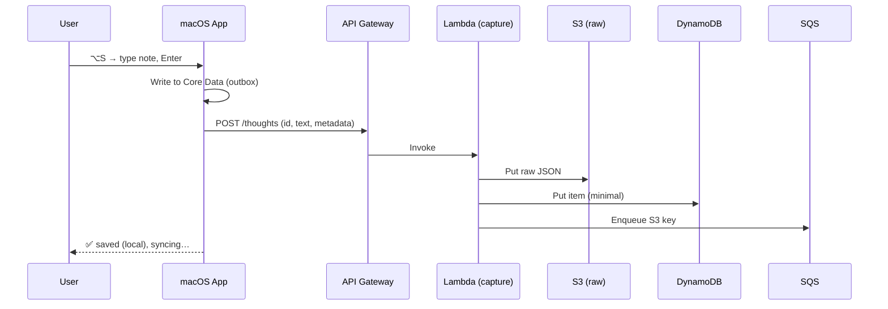
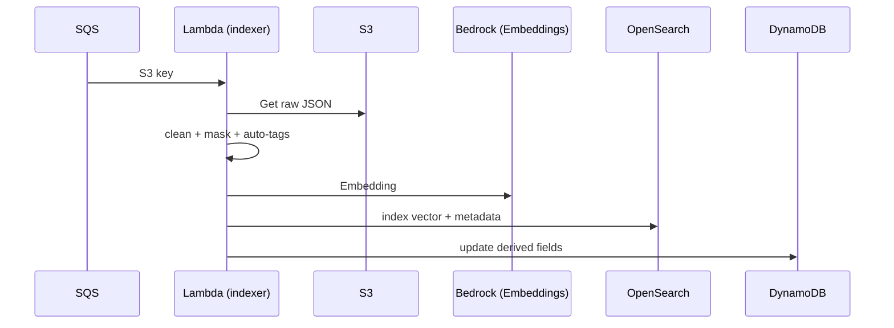

# Ultrathink — Personal Memory & Recall

**Status:** Draft v1 • **Platform:** macOS client + AWS backend • **Scope:** Single-user (no auth for v1) • **Hotkeys:** ⌥S (capture), ⌥F (ask)

**Authors:** Bobby × GPT-5 Thinking • **Date:** Aug 20, 2025

---

## 0. executive summary
Ultrathink is a local-first, blazing-fast notes capture + recall system. You press **⌥S** to capture a thought, code, link, or tag; it saves offline instantly and syncs to AWS where it is chunked, embedded, and indexed for retrieval. You press **⌥F** to ask questions (e.g., *“why did I do this?”*); Ultrathink returns a concise answer **with timestamped citations** of the exact notes that justify it. The app also provides a **timeline** and a **graph** view that make clusters of ideas obvious.

We optimize for: (1) sub‑150ms local capture, (2) trustworthy, citation‑first recall, (3) future‑proof security seams.

---

## 1. goals & non‑goals
### 1.1 goals
- Lightning capture (⌥S) and ask (⌥F) with **zero friction**.
- **Citation‑first** answers with dates and direct preview of the supporting notes.
- **Beautiful recall UIs**: Feed, Timeline heatband, and Topic Graph.
- Sync to AWS with **server-side embeddings + hybrid (BM25+kNN) retrieval**.
- Clear seams to add auth later (Cognito/IdC), but **no auth in v1**.
- All storage **encrypted at rest** and **in transit**; minimal logs; no secrets in notes.

### 1.2 non‑goals (v1)
- Multi‑user sharing, organization policies, or ACLs.
- Mobile/Windows clients.
- Real‑time collaborative editing.
- Cross‑workspace ingestion (PRs/Confluence/Slack). This v1 is **your thoughts only**.

---

## 2. user stories
- *As Bobby*, when I press **⌥S**, a spotlight‑style sheet appears. I type a thought like: `Switched to SQS over SNS because DLQ & ordering #infra !decision`. Pressing ↩ saves offline, shows a ✅, and syncs when online.
- *As Bobby*, when I press **⌥F** and ask *“why did I switch to SQS?”*, I get a 2–3 sentence answer plus citations: `• Aug 2, 2025 — “Switched to SQS over SNS because …”`.
- *As Bobby*, I can scrub a **timeline** to see dense periods, and view a **graph** where related thoughts cluster; I hover to preview, click to open.

---

## 3. architecture (high level)
```
macOS (SwiftUI)                           AWS (Serverless)
──────────────────────────────────────────────────────────────────────────
⌥S capture sheet → Local SQLite → Sync agent → API Gateway (HTTP API)
                                            → Lambda: capture → S3 (raw JSON)
                                                            → SQS → Lambda: indexer
                                                                    ↳ Bedrock Embeddings → OpenSearch (vector)
                                                                    ↳ Summaries/auto-tags → DynamoDB (metadata)
⌥F ask sheet → /ask API → Lambda: ask → Hybrid retrieval (OS) → Bedrock (Gen) → Answer + citations

Graph view → /graph → Lambda: graph-builder (kNN edges, UMAP layout) → S3 static JSON
```

**Design rationale:** Keep the Mac client local-first for snappiness; minimize backend moving parts; choose **OpenSearch Serverless Vector Engine** for hybrid search; keep DynamoDB for metadata and fast feeds; use S3 as the source of record.

---

## 4. components (detailed)
### 4.1 macOS app (SwiftUI + AppKit)
- **Global hotkeys**: ⌥S opens capture sheet; ⌥F opens ask sheet. Implemented via NSEvent global monitors + a small event tap. The sheet is a borderless, centered window with a blurred background.
- **Capture sheet**: Markdown editor with fenced code blocks, inline tags (`#tag`), and flags (`!todo`, `!idea`, `!decision`). Shows character count and a local‑save ✅.
- **Local store**: Core Data over SQLite (`ultrathink.db`). Tables: `notes`, `outbox`, `settings`. DB is encrypted with a key stored in Keychain.
- **Context capture (optional)**: with Accessibility permission, store frontmost app + title; attempt to read repo/branch when VS Code/Xcode is active (AppleScript/CLI). User‑toggleable.
- **Sync agent**: background task that drains `outbox` to `/thoughts`, exponential backoff, idempotency (client‑generated `id`).
- **Ask sheet**: simple input → calls `/ask` → renders structured answer (summary + citations list) with tap‑to‑expand items opening the full note in the main app.
- **UI views**: Feed (reverse chrono + filters), Timeline heatband (scrubbable), Graph (2D/3D SceneKit view of clusters).

### 4.2 API layer (API Gateway HTTP API)
- Routes: `POST /thoughts`, `POST /ask`, `GET /thoughts`, `GET /graph`.
- For v1, use a static **API key** in the app bundle (stored in Keychain); later replace with Cognito/IdC. CORS locked to the app’s bundle; TLS required.

### 4.3 Data ingestion
- **capture (Lambda)**: Validates payload, writes raw JSON to `s3://ultrathink-raw/{date}/{id}.json` (SSE‑KMS), writes a minimal row to DynamoDB (`thoughts`) and enqueues the S3 key to SQS.
- **indexer (Lambda)**: Reads S3 JSON; cleans/normalizes text; detects secrets (regex entropy); masks before proceed; computes **Titan Embeddings** (Bedrock); writes `embedding + metadata` to **OpenSearch Serverless** (`notes` index); updates DynamoDB with derived fields (summary, auto‑tags, decision_score, embedding_id). Idempotent via `id` + content hash.

### 4.4 Retrieval & generation
- **ask (Lambda)**:
  1) **Query rewrite** → expand with synonyms (why/because/rationale/tradeoff) and extract tags/time hints.
  2) **Hybrid retrieval** against OpenSearch: BM25 on `text, summary, tags` + k‑NN cosine on `embedding`.
  3) **Scoring**: `score = 0.4*bm25 + 0.4*cos + 0.15*recency + 0.05*decision_score`.
  4) Top‑k (100) → optional cross‑encoder rerank → k=6.
  5) Assemble snippets with timestamps and first ~20 words; ensure non‑overlapping.
  6) **Generate** with Bedrock (Claude/Titan) using a **citations‑required** prompt; trim to 3–5 citations.
  7) Return `{answer, citations[]}`.

### 4.5 Graph builder
- On capture or nightly, compute **k‑NN edges** for new notes (cosine ≥ 0.78).
- Run UMAP (or t‑SNE) in a small batch Lambda to derive 2D coordinates. Store as `s3://ultrathink-artifacts/graph/YYYY-MM.json` (nodes: id, x,y, tags, recency; edges: id1,id2,sim).
- Client streams this JSON to render an interactive graph (pan/zoom, hover previews, filter chips).

---

## 5. data model
### 5.1 Thought (raw JSON stored in S3; mirrored fields in DynamoDB)
```json
{
  "id": "t_01J8X8K5E4YQZ…",
  "user": "dev",
  "created_at": "2025-08-02T19:12:31Z",
  "text": "Switched to SQS over SNS because DLQ & ordering #infra !decision",
  "type": "note|code|link|todo|decision|rationale",
  "tags": ["infra"],
  "context": {
    "app": "VSCode",
    "window_title": "service-foo — queue.go",
    "repo": "org/service-foo",
    "branch": "feature/sqs",
    "file": "queue.go"
  },
  "derived": {
    "summary": "Chose SQS over SNS due to DLQ & ordering",
    "decision_score": 0.82
  }
}
```

### 5.2 DynamoDB `thoughts`
- **PK**: `user#dev`
- **SK**: `ts#<epoch>#<id>`
- **Attributes**: `text`, `type`, `tags`, `context`, `summary`, `decision_score`, `embedding_id`, `created_at`
- **GSIs**: `GSI1` on `tags`, `GSI2` on `type` (for filters in Feed).

### 5.3 OpenSearch `notes` index (Serverless Vector Engine)
- `id` (keyword), `text` (text), `summary` (text), `tags` (keyword), `type` (keyword), `created_at_epoch` (date), `decision_score` (float), `embedding` (knn_vector, 1024 dims)

### 5.4 Local Core Data (encrypted SQLite)
- `notes(id, created_at, text, type, tags_json, context_json, synced_at, outbox_state)`
- `settings(api_key, last_sync_at, hotkeys, privacy_flags)`

---

## 6. API spec (v1)
### POST /thoughts
**Body**
```json
{
  "id": "client-generated uuid",
  "created_at": "iso8601 (optional; server will set if missing)",
  "text": "markdown string",
  "type": "note|code|link|todo|decision|rationale",
  "tags": ["…"],
  "context": {"app":"…","window_title":"…","repo":"…","branch":"…","file":"…"}
}
```
**Response**: `201 { id, created_at }`

### POST /ask
**Body**
```json
{ "query": "why did I switch to sqs?", "time_window": "90d", "tags": ["infra"] }
```
**Response**
```json
{
  "answer": "You switched to SQS …",
  "citations": [
    {"id":"t_…","created_at":"2025-08-02T19:12:31Z","preview":"Switched to SQS over SNS because…","score":0.87},
    {"id":"t_…","created_at":"2025-07-28T09:03:10Z","preview":"Tradeoff: sns vs sqs …","score":0.79}
  ]
}
```

### GET /thoughts
Query params: `from`, `to`, `tag`, `type`, `limit`, `cursor`

### GET /graph
Query params: `month=YYYY-MM` → returns `{nodes:[{id,x,y,tags,recency}], edges:[{a,b,sim}]}`

**Common**: API key header `x-api-key`. JSON only. 429 on rate exceed.

---

## 7. retrieval algorithm
1. **Rewrite** query → keywords (why/because/rationale/tradeoff/decision), extract tags and time window.
2. **Hybrid search** in OpenSearch: BM25 + k‑NN.
3. **Score**: `0.4*BM25 + 0.4*cosine + 0.15*recency + 0.05*decision_score`.
4. **Rerank** (optional cross‑encoder) → pick top 6.
5. Assemble context and **Generate** short answer; require 3–5 citations.
6. If confidence < threshold, reply with “Not sure; closest notes are …”.

---

## 8. security, privacy, compliance (v1)
- **Encryption**: S3, DynamoDB, OpenSearch, CloudWatch Logs all with **SSE‑KMS** (one CMK per domain). TLS 1.2+.
- **Secrets**: Only in **Secrets Manager** (Bedrock, OpenSearch API access if needed). No secrets in code or env vars.
- **PII/Secrets scrubbing**: indexer masks tokens/keys (`sk-…`) and flags `contains_sensitive=true` (used for filtering or warning banners).
- **Logging**: No note contents in logs. Only ids, timings, sizes, and error codes.
- **Auth (future)**: swap API key for Cognito or IAM Identity Center; add per‑user partition keys and JWT verification.

---

## 9. performance budgets
- **Capture**: local write ≤ 20ms; UI close ≤ 120ms; cloud sync ≤ 1.2s p95 when online.
- **Ask**: retrieval ≤ 700ms p95; generate ≤ 1.6s p95; end‑to‑end ≤ 2.5s p95.
- **Indexing**: end‑to‑end ≤ 2s per note (embedding dominates).

---

## 10. observability
- **Metrics**: capture_latency_ms, sync_success_rate, index_latency_ms, ask_retrieval_ms, ask_latency_ms, answer_length_tokens, citation_count, abstain_rate.
- **Dashboards**: Lambda durations, errors; OpenSearch search latency; Bedrock invocation count/latency.
- **Alerts**: SQS DLQ > 0, index failures > 1%/hour, ask p95 latency > 4s for 10m.

---

## 11. failure modes & mitigations
- **Offline capture** → stays in `outbox`; menubar dot indicates unsynced items.
- **API down** → exponential backoff; never block local capture.
- **Embedding failure** → auto‑retry; fallback to keyword‑only retrieval until embedding exists.
- **OpenSearch throttle** → backpressure from indexer; ask path switches to BM25‑only briefly.
- **Large notes** (>50KB) → chunk server‑side; store parent id and chunk id; citations point to chunk ranges.

---

## 12. cost notes (rough)
- S3: pennies until large volumes.
- DynamoDB on‑demand: minimal.
- OpenSearch Serverless vector collection: steady baseline + autoscaling with QPS.
- Bedrock: cost per embedding + per generation; cache embeddings; batch requests where possible.
- Lambdas: millisecond‑scale with small memory footprints.

*(Exact numbers will depend on daily notes and queries; we’ll set CloudWatch budgets/alerts.)*

---

## 13. rollout plan
- **M0**: Mac app capture only → `/thoughts` → Feed view.
- **M1**: Indexer + `/ask` → citations in Ask sheet.
- **M2**: Timeline + Graph; nightly layout; filter chips.
- **M3**: Replace API key with Cognito; private VPC endpoints.

---

## 14. risks & mitigations
- **No auth in v1** → dev‑only API key; mitigate by limiting deployment to a private AWS account, rate limiting, and rotating the key.
- **Model drift** → pin embedding/generation model versions; re‑index on major upgrades.
- **Privacy leaks via logs** → content‑free logging policy; automated lint in CI to block `console.log(text)`.

---

## 15. open questions
- What’s the maximum note size we want to support before chunking? (Propose 50KB)
- Do we want local embeddings in v1 for instant graphing? (Propose server‑only first.)
- Is 0.78 similarity the right edge threshold for the graph? (Start there; tune by eyeballing clusters.)

---

## 16. appendix
### 16.1 sequence — capture


### 16.2 sequence — ask
```mermaid
sequenceDiagram
  participant User
  participant Mac
  participant API
  participant Ask as Lambda (ask)
  participant OS as OpenSearch
  participant BR as Bedrock

  User->>Mac: ⌥F → ask
  Mac->>API: POST /ask
  API->>Ask: Invoke
  Ask->>Ask: rewrite query
  Ask->>OS: hybrid search (BM25 + kNN)
  Ask->>BR: generate with citations
  Ask-->>Mac: answer + citations
  Mac-->>User: render answer; click to expand notes
```

### 16.3 sequence — indexer


---

### 16.4 prompts
**Rewrite (system)**
> Expand the user’s question into search terms and intent. Add synonyms for why/rationale/decision. Return JSON {keywords[], filters{}, hints[]}.

**Answer (system)**
> You are my memory. Use only provided notes. First answer briefly. Then list 3–5 citations as "• {Date} — {first 12 words}". If unsure, say so. Never invent citations.

---

## 17. definition of done (v1)
- ⌥S capture with offline queue and sync ✔
- ⌥F ask → answer with ≥3 citations ✔
- Feed + Timeline heatband + Graph (static monthly layout) ✔
- Indexing pipeline with embeddings + hybrid retrieval ✔
- KMS everywhere; no content in logs ✔
- CI/CD (CDK) with canary stack; runbooks for failures ✔

